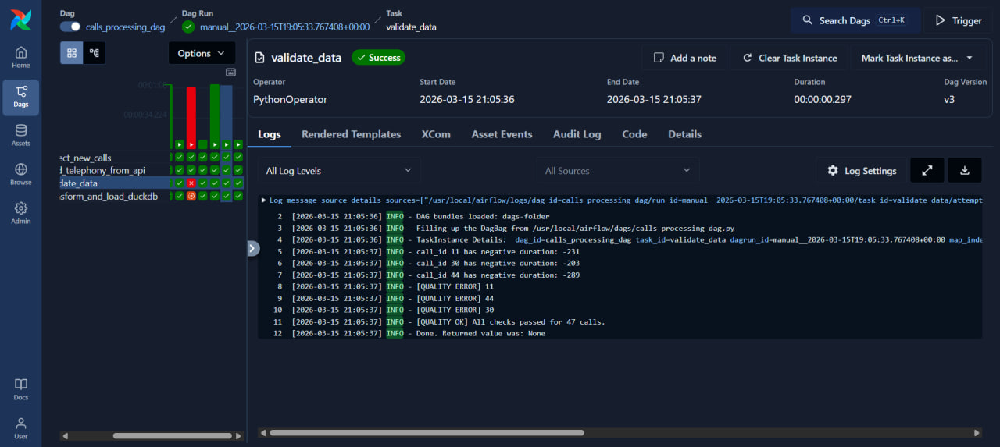
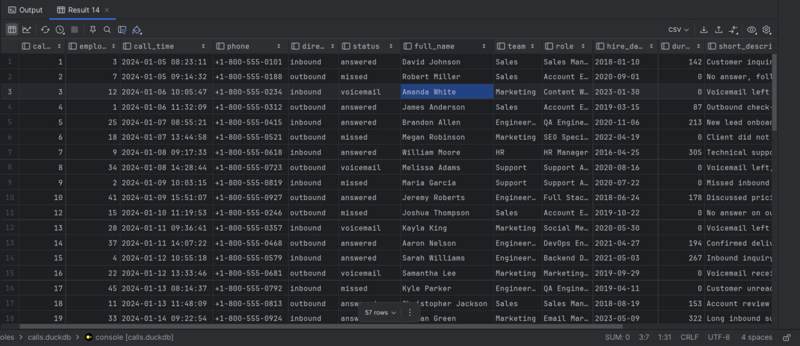

# Calls Data Pipeline

A data engineering assignment project built with Apache Airflow, MySQL, and DuckDB.

## Overview



This project implements an incremental ETL pipeline that merges call data from two sources — a MySQL database and a mock Telephony API (JSON files) — and loads the enriched result into DuckDB for analytics.

## Stack

- **Apache Airflow** — orchestration and scheduling
- **MySQL** — source of structured call and employee data
- **DuckDB** — analytical warehouse for enriched output
- **Docker** — containerized Airflow deployment

## Pipeline Structure

```
detect_new_calls → load_telephony_from_api → validate_data → transform_and_load_duckdb
```

1. **detect_new_calls** — queries MySQL for calls newer than the last watermark, stored as an Airflow Variable
2. **load_telephony_from_api** — reads JSON files and extracts duration and description for each call
3. **validate_data** — filters out records with negative duration, missing employees, or duplicate call IDs
4. **transform_and_load_duckdb** — joins MySQL and JSON data, writes enriched records incrementally into DuckDB

## Result

A fully automated hourly pipeline that incrementally loads and enriches call records into a `calls_big_table` in DuckDB, combining employee info from MySQL with telephony metadata from JSON files.


